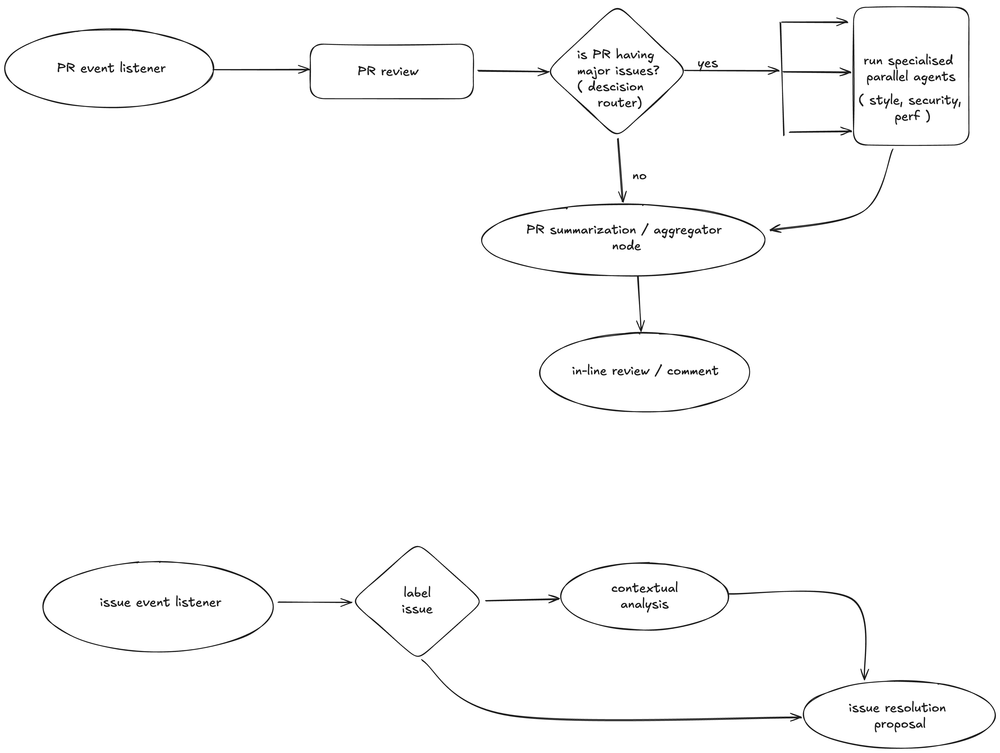

# annotated notes for the project

features to include:
- identify the issue type or label the issue - deterministic flow
- issue resolution - non-deterministic flow, how ? --> given an issue, first the LM will identify the issue type, then it will suggest a resolution based on the issue type, can use specialized agents here
- provide PR summary - deterministic flow
- perform code review checking for code smells, adherence to style guides (like PEP 8, Google Style Guides), complexity metrics (cyclomatic complexity), and anti-patterns.
- suggest code changes
- static analysis like linting and type checking
- automatically generate PR descriptions and changelogs
- maybe think around suggesting unit level tests based on the changes in the PR ?

current state implements generic global level pr review as a comment, how about making it in-line review?
- for a truly context aware system, have to keep track of the pr history and other events history -- state and memory management need !

how do i build a context aware system which keeps track of the PR history of the project and other events ?
- maybe use a db as knowledge base layer to store PR data and other events

system architecture:

